<p align="center">
    
</p>

<h1 align="center">📈 TradeLedger</h1>

<p align="center">
Modern Investment & Trading Portfolio Management Platform
</p>

<p align="center">
Manage portfolios, record trades, analyze investments, and build long-term wealth in one place.
</p>

<p align="center">


</p>

---

# ✨ Core Features

## 📊 Dashboard

Monitor your investment performance, portfolio value, profit & loss, market summary, and asset allocation from one place.

### 💻 Desktop

<p align="center">
    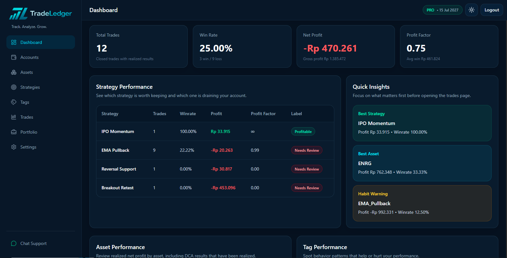
</p>

<p align="center">
    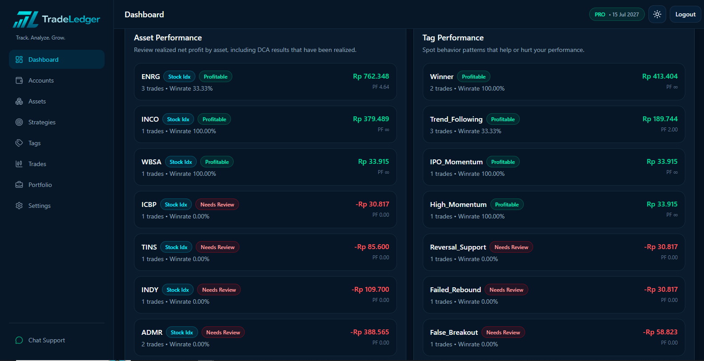
</p>

### 📱 Mobile

<p align="center">
    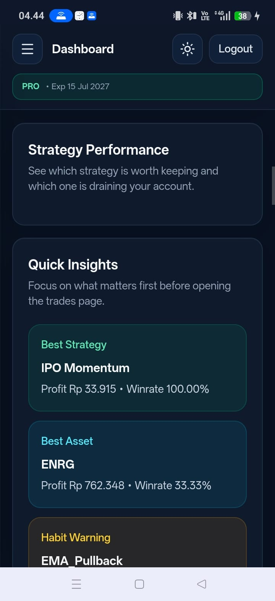
    &nbsp;&nbsp;
    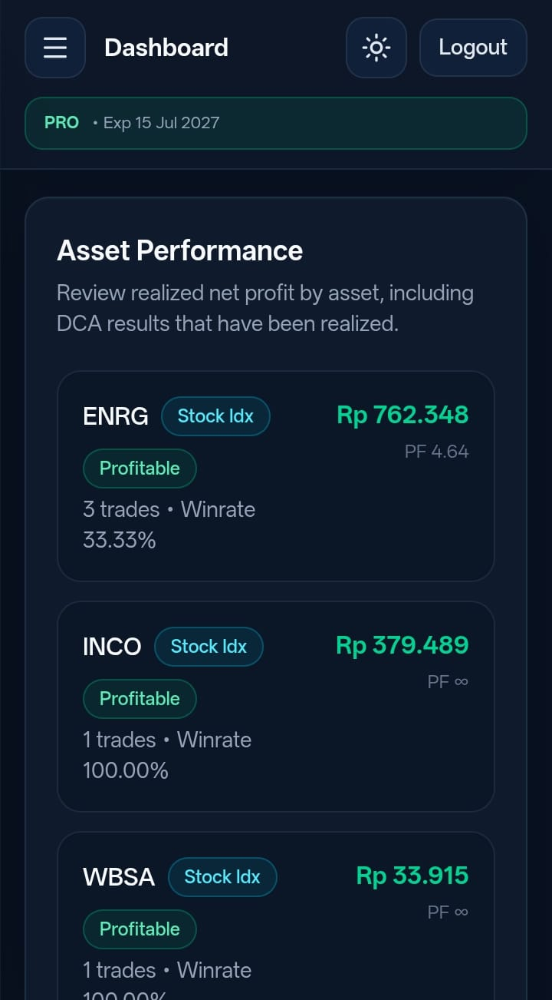
</p>

---

## 💼 Portfolio Management

Manage multiple portfolios, monitor allocations, average cost, unrealized profit & loss, and investment growth.

### 💻 Desktop

<p align="center">
    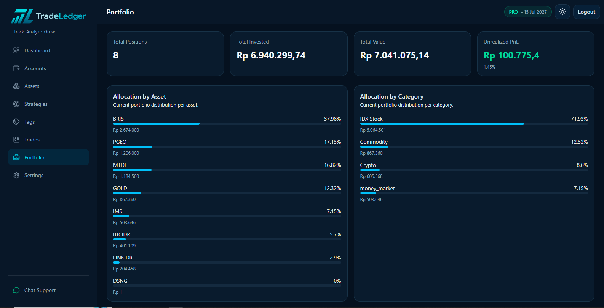
</p>

<p align="center">
    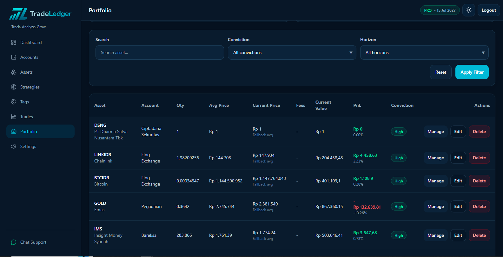
</p>

### 📱 Mobile

<p align="center">
    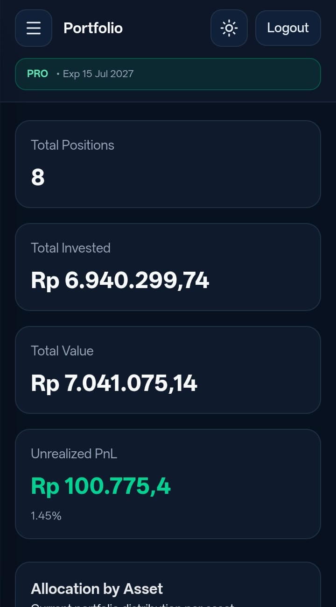
    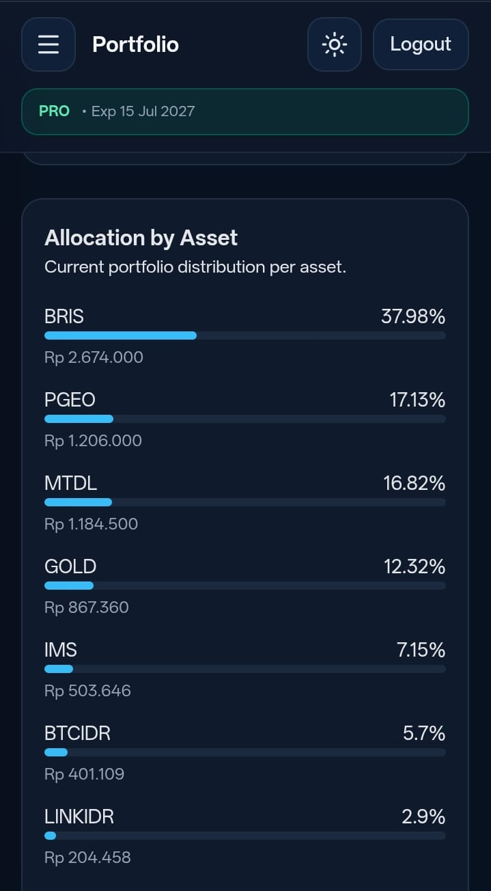
    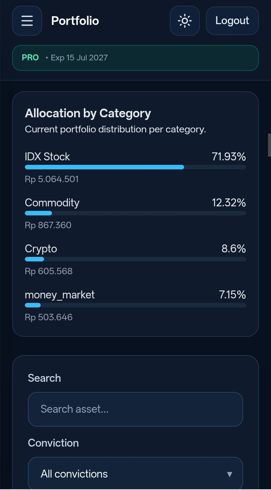
    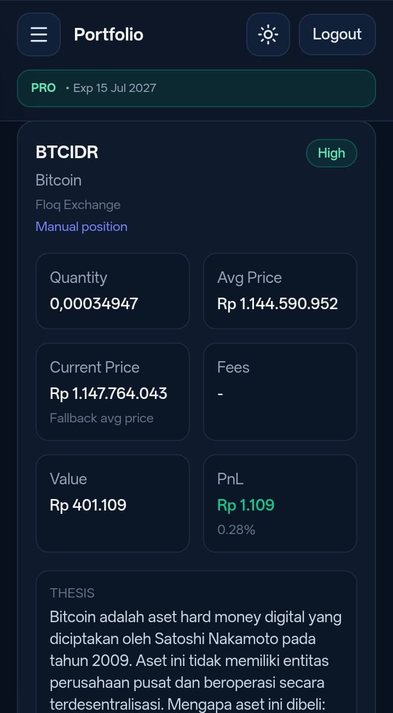
</p>

---

## 📈 Trading Journal

Track every trade, monitor open positions, evaluate win rate, and analyze trading performance.

### 💻 Desktop

<p align="center">
    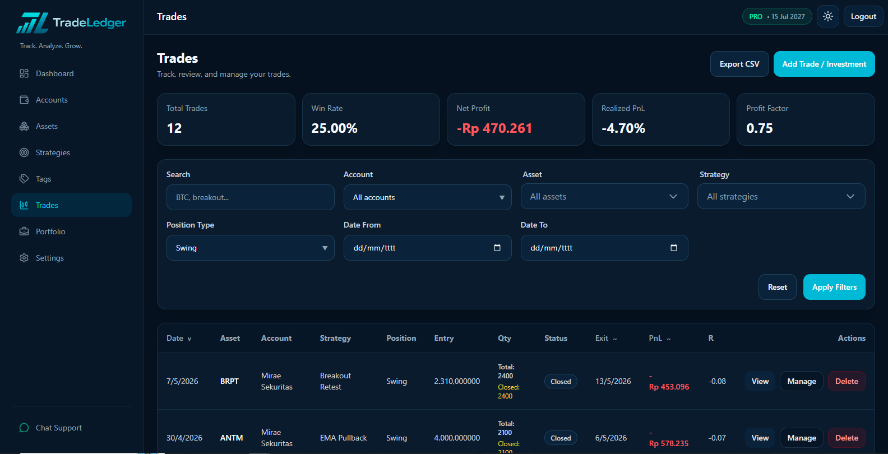
</p>

### 📱 Mobile

<p align="center">
    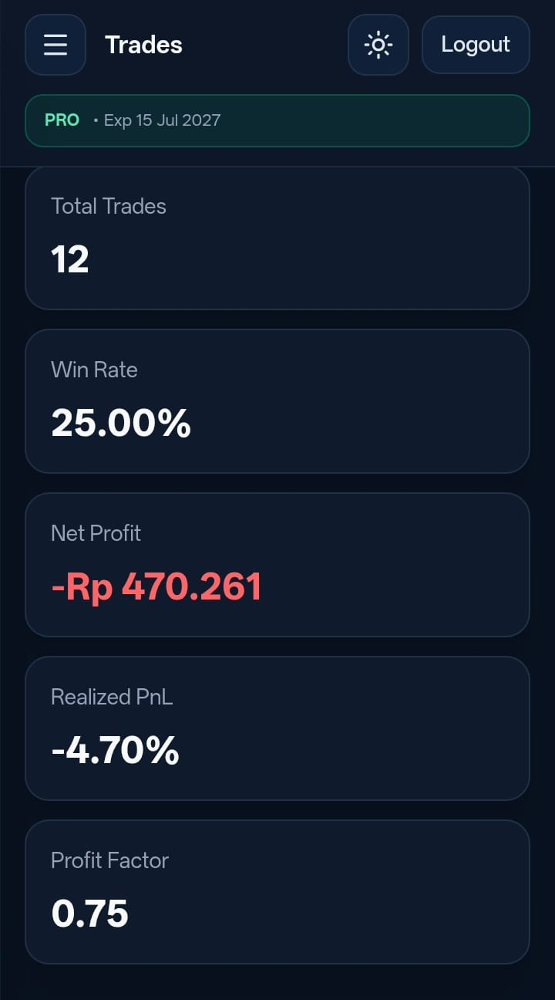
    &nbsp;&nbsp;
    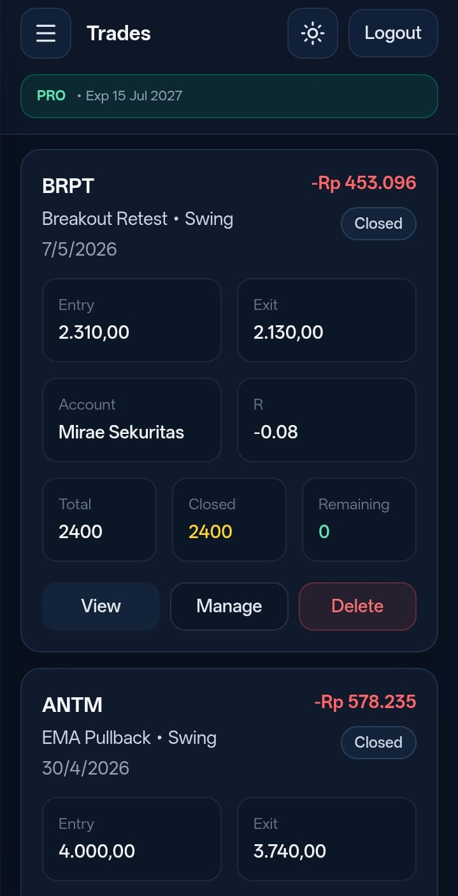
</p>

---

## 📊 Investment Analytics

Analyze portfolio performance, allocation, gain/loss, investment growth, and financial insights.

### 💻 Desktop

<p align="center">
    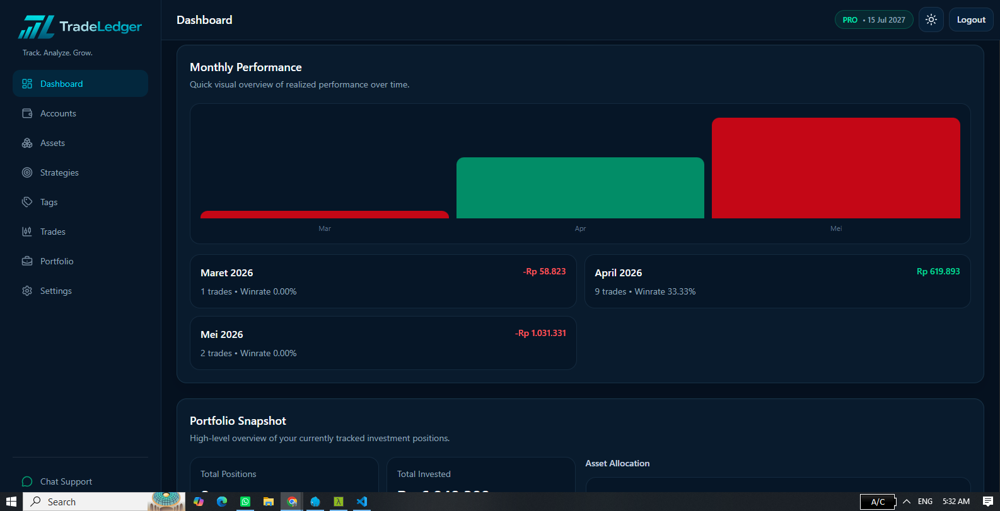
</p>

### 📱 Mobile

<p align="center">
    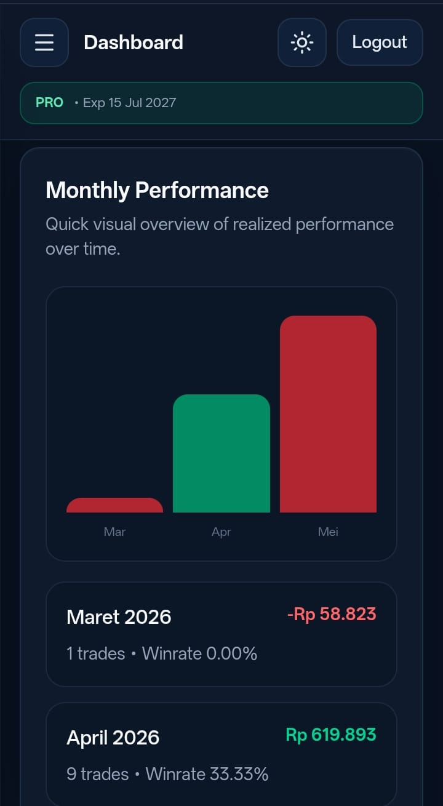
</p>

---

## 👑 Premium Membership

Unlock premium investment features with subscription management and payment verification.

### 💻 Desktop

<p align="center">
    
</p>

### 📱 Mobile

<p align="center">
    
</p>

---

# 🏗 System Architecture

```text
                   Vue.js 3 + Vite
                          │
                     REST API
                          │
                  Laravel 12 Backend
                          │
        ┌─────────────────┴─────────────────┐
        │                                   │
      MySQL                              Redis
```

---

# 🛠 Tech Stack

## Backend

- PHP 8.2
- Laravel 12
- MySQL
- Laravel Sanctum
- PHPUnit

## Frontend

- Vue.js 3
- Vue Router
- Pinia
- Tailwind CSS
- Axios
- Vite

## DevOps

- Docker
- Docker Compose
- Nginx
- GitHub Actions *(Planned)*

---

# 📂 Project Structure

```text
gettradeledger.com
│
├── backend
│   ├── app
│   ├── routes
│   ├── database
│   ├── tests
│   └── ...
│
├── frontend
│   ├── src
│   ├── public
│   └── ...
│
│
├── docker-compose.yml
└── README.md
```

---

# 🚀 Getting Started

## Clone Repository

```bash
git clone https://github.com/yourusername/gettradeledger.com.git

cd gettradeledger.com
```

---

## Development

```bash
docker compose up -d
```

Frontend

```
http://localhost:5173
```

Backend

```
http://localhost:14022
```

---

## Production

```bash
docker compose -f docker-compose.prod.yml up -d
```

---

# 🐳 Docker Documentation

| Environment | Documentation |
|-------------|---------------|
| Development | docs/docker-development.md |
| Production | docs/docker-production.md |

---

# 📦 REST API

TradeLedger provides RESTful APIs for:

- Authentication
- Portfolio
- Assets
- Accounts
- Trades
- Analytics
- Premium Membership
- Payments
- Currency Conversion

---

# 🧪 Testing

Run all tests

```bash
php artisan test
```

Run tests in parallel

```bash
php artisan test --parallel
```

---

# 🗺 Roadmap

## Version 1.0

- [x] Authentication
- [x] Portfolio Management
- [x] Trading Journal
- [x] Investment Analytics
- [x] Multi Currency
- [x] Premium Membership
- [x] Docker Support

## Version 1.5

- [ ] Dividend Module
- [ ] Dividend Calendar
- [ ] Watchlist
- [ ] Stock Screener

## Version 2.0

- [ ] Portfolio Rebalancing
- [ ] AI Investment Assistant
- [ ] Automatic Price Sync
- [ ] Mobile Application

---

# 📚 Documentation

- Docker Development
- Docker Production
- REST API Documentation
- Deployment Guide
- Contribution Guide

---

# 🤝 Contributing

Contributions are welcome.

```bash
feature/new-feature
```

---

# 📄 License

This project is licensed under the MIT License.

---

# 👨‍💻 Author

**Muhammad Pandi Ferry Permana**

Software Engineer • Backend Developer • Investment Enthusiast

---

# 🌍 Vision

TradeLedger aims to become an all-in-one Investment Operating System that helps investors manage portfolios, analyze investments, record trades, monitor dividends, and build long-term wealth through a modern and intuitive platform.